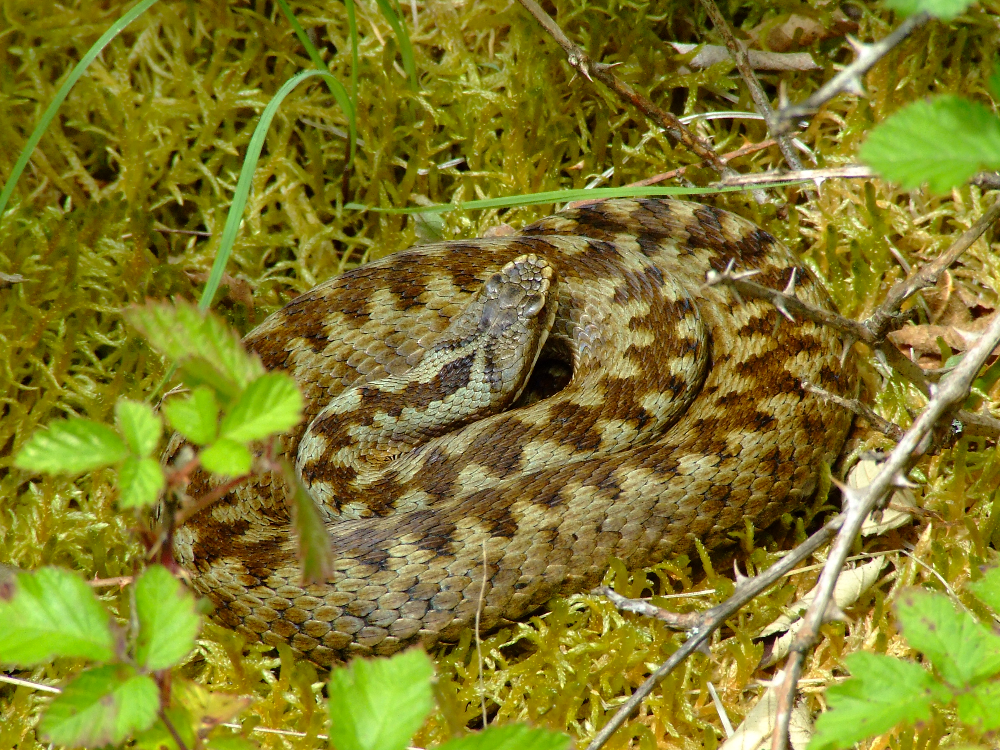

```{r setup, include = FALSE}
library(knitr)
library(dplyr)
```

<!-- adding bold and italic options -->
<style>
em {
  font-style: italic
}
strong {
  font-weight: bold;
}
</style>

## Lecture schedule

1. Drift and variation (Evolution: Chapter 6)
2. **Conservation genetics (Evolution: Chapter 6)**
3. Phylogeny 1 (Evolution: Chapter 16)
4. Phylogeny 2 (Evolution: Chapter 16)

---

## Genetic drift summary

- Allele frequencies will change from one generation to the next due to chance events
- Such as survival, reproduction, and inheritance.
- Drift is unbiased, no allele is favoured
- **Drift causes a loss of genetic variation** (replaced by mutation or gene flow)
- **Strength of drift is larger in small populations**
- Drift causes populations to become different
- Selection share some features with drift, but alleles are favoured
- Selection is more effective when drift is weak
- We need to account for drift when testing for selection

--- .segue .dark 

## Effective population size

---

## Effective population size (Ne)

**The effective population size (Ne) is the size of an idealised hermaphroditic population that would show the observed amount of drift**

- Loosely, the effective number of breeding individuals

**This is typically different to the census population size**

- Age of reproduction
- Mating systems
- Population structure
- Sex ratio
- Non-random mating

---

## Age of reproduction

```{r, out.width = "75%", dpi = 300, echo = FALSE, fig.align = "center", fig.cap=""}
  include_graphics("./assets/img/agave.jpg")
```

---

## Mating systems

```{r, out.width = "80%", dpi = 300, echo = FALSE, fig.align = "center", fig.cap=""}
  include_graphics("./assets/img/MacquarieIslandElephantSeal.JPG")
```

---

## Population structure

```{r, out.width = "80%", dpi = 300, echo = FALSE, fig.align = "center", fig.cap=""}
  include_graphics("./assets/img/066-Bridgehampton-NY-06.jpg")
```

---

## Sex ratio

```{r, out.width = "90%", dpi = 300, echo = FALSE, fig.align = "center", fig.cap=""}
  include_graphics("./assets/img/turtle.jpg")
```

---

## Non-random mating

```{r, out.width = "90%", dpi = 300, echo = FALSE, fig.align = "center", fig.cap=""}
  include_graphics("./assets/img/pandas.webp")
```

---

## Loss of genetic variation associated with low Ne

<iframe src = 'https://heavywatal.github.io/driftr.js/'></iframe>

--- .segue .dark 

## Why is low genetic variation bad?

--- &twocol

## Smygehuk adders

*** =left

- Population in Sweden
- Low Ne
- Isolated > 100 years
- low genetic diversity
- Population decline
- Many offspring deformed/stillborn

*** =right

```{r, out.width = "70%", dpi = 300, echo = FALSE, fig.align = "center", fig.cap=""}
  
```

```{r, out.width = "70%", dpi = 300, echo = FALSE, fig.align = "center", fig.cap=""}
  include_graphics("./assets/img/adder_male2.JPG")
```

--- &twocol

## Genetic rescue

*** =left

```{r, out.width = "100%", dpi = 300, echo = FALSE, fig.align = "center", fig.cap=""}
  include_graphics("./assets/img/adders.svg")
```

*** =right

- 20 males from other (large) populations released
- Left for 4 years
- Remaining 8 males returned to source population
- Dramatic increase in recruitment
- Increase in genetic diversity
- Reduction in stillborn offspring

---

## Adders background reading

```{r, out.width = "100%", out.height=500, dpi = 300, echo = FALSE, fig.cap=""}
  include_graphics("./assets/img/Madsen_adders.pdf")
```

--- 

## What is going on?

<iframe src = 'https://heavywatal.github.io/driftr.js/'></iframe>

---

## Why is low genetic variation bad?

- At **small population sizes** drift overwhelms the rate of mutation
- In **isolated** populations variation cannot be replaced by gene flow
- Net loss of genetic diversity

### Inbreeding depression

- Deleterious alleles more likely to increase in frequency (selection less effective)
- Deleterious alleles tend to be recessive
- Individuals increasingly homozygous as allele frequency increases (**Hardy-Weinberg**)

### Reduced evolutionary potential

- No variation = no evolution
- Unpredictable because we don't know the future precisely (disease, climate change, etc)

--- 

## Inbreeding depression

<iframe src = 'https://heavywatal.github.io/driftr.js/'></iframe>

--- 

## Reduced evolutionary potential

<iframe src = 'https://heavywatal.github.io/driftr.js/'></iframe>

--- &twocol

## Genetic rescue

*** =left

```{r, out.width = "100%", dpi = 300, echo = FALSE, fig.align = "center", fig.cap=""}
  include_graphics("./assets/img/adders.svg")
```

*** =right

- 20 males from other (large) populations released
- Left for 4 years
- Remaining 8 males returned to source population
- Dramatic increase in recruitment
- Increase in genetic diversity
- Reduction in stillborn offspring

--- .segue .dark 

## Conservation genetics

---

## Conservation genetics

- Applied population genetics to help conserve species

### How can it help?

- **Measure genetic variation**
- **Measure inbreeding**
- Guide breeding programmes
- Identify ancestry
- Wildlife crime

--- &twocol

## Methods: genetic variation

*** =left

**Heterozygosity**

- Measured from a single individual
- How many diploid loci have different alleles
- For example, het sites per kb

**Nuceotide diversity (π)**

- Population average heterozygosity
- Proportion of het positions between 2 randomly selected chromosomes

*** =right

```{r, out.width = "75%", dpi = 300, echo = FALSE, fig.align = "center", fig.cap=""}
  include_graphics("./assets/img/Gene_Loci_and_Alleles.png")
```

---

## Methods: inbreeding

- Chromosome regions are identical by descent
- Can be calculated from pedigrees
- Genome sequencing allows identification of **runs of homozygosity (ROH)**

```{r, out.width = "75%", dpi = 300, echo = FALSE, fig.align = "center", fig.cap=""}
  include_graphics("./assets/img/recom_roh.svg")
```

---

## Methods: runs of homozygosity (ROH)

- Total inbreeding = ROH content
- Recent = long ROH
- Older = short ROH

```{r, out.width = "95%", fig.width = 8, fig.height = 3, dpi = 300, echo = FALSE, fig.align='center', fig.cap=""}
my_roh_hi <- jitter(c(rep(0.0013, times=100)), factor=5)
my_roh_lo <- jitter(c(rep(0.0000000001, times=100)), factor=6)
my_roh <- c(my_roh_hi, my_roh_lo, my_roh_lo, my_roh_hi, my_roh_hi, my_roh_hi, my_roh_lo, my_roh_hi, my_roh_hi, my_roh_hi)

plot(c(1:1000), my_roh, type="l", 
ylim=c(0,0.0015), axes=FALSE, frame.plot=TRUE,
xlab="Chromosome position (Mb)", ylab="Het sites/kb",
main=""
)

axis(1, at=c(0,200,400,600,800,1000), labels=c("0","20","40","60","80","100"), las=1)
axis(2, at=c(0,0.0005,0.001,0.0015), labels=c("0","0.5","1.0","1.5"), las=2)
```

--- .segue .dark 

## Case studies

--- &twocol

## White rhinos (*Ceratotherium simum*)

*** =left

- Two subspecies: northern and southern
- ~20,000 southern white rhinos (in 2015)
- Northern white rhino functionally extinct (2 females left in 2018)

```{r, out.width = "65%", dpi = 300, echo = FALSE, fig.align='center', fig.cap=""}
include_graphics("./assets/img/rhin_map.svg")
```

*** =right

```{r, out.width = "60%", dpi = 300, echo = FALSE, fig.align='center', fig.cap=""}
include_graphics("./assets/img/1920px-Ceratotherium_simum_(21922261908).jpg")
```

```{r, out.width = "75%", dpi = 300, echo = FALSE, fig.align='center', fig.cap=""}
include_graphics("./assets/img/rhin_demo.svg")
```

---

## White rhinos (*Ceratotherium simum*)

```{r, out.width = "100%", dpi = 300, echo = FALSE, fig.align='center', fig.cap=""}
include_graphics("./assets/img/rhin_res.svg")
```

---

## White rhinos background reading

```{r, out.width = "100%", out.height=500, dpi = 300, echo = FALSE, fig.cap=""}
  include_graphics("./assets/img/Sánchez-Barreiro et al. - 2021 - Historical population declines prompted significant genomic erosion in the northern and southern white.pdf")
```

--- &twocol

## Pumas (*Puma concolor*)

*** =left

- Puma/cougar/mountain lion/panther
- Widespread across North and South America
- IUCN listed as least concern
- But some populations are small and isolated
- E.g. Florida panther listed as critically endangered
- 8 females introduced from Texas to reduce inbreeding

*** =right

```{r, out.width = "100%", dpi = 300, echo = FALSE, fig.align='center', fig.cap=""}
include_graphics("./assets/img/puma_10.jpg")
```

---

## Pumas (*Puma concolor*)

```{r, out.width = "100%", dpi = 300, echo = FALSE, fig.align='center', fig.cap=""}
include_graphics("./assets/img/puma_map.svg")
```

---

## Pumas (*Puma concolor*)

```{r, out.width = "100%", dpi = 300, echo = FALSE, fig.align='center', fig.cap=""}
include_graphics("./assets/img/puma_roh.svg")
```

---

## Pumas background reading

```{r, out.width = "100%", out.height=500, dpi = 300, echo = FALSE, fig.cap=""}
  include_graphics("./assets/img/Saremi et al. - 2019 - Puma genomes from North and South America provide insights into the genomic consequences of inbreeding.pdf")
```

--- &twocol

## Isle Royale wolves

*** =left

- Colonised 2-3 wolves in 1940s
- Expanded to 50 individuals
- Crashed to 14 individuals in 1980s
- Notable improvement 1997 with migration of a single male, followed by second crash
- Moose increased in this period
- 2 wolves left in 2018: father-daughter and half sibs

*** =right

```{r, out.width = "85%", dpi = 300, echo = FALSE, fig.align='center', fig.cap=""}
include_graphics("./assets/img/wolf-isle-royale.jpg")
```

```{r, out.width = "85%", dpi = 300, echo = FALSE, fig.align='center', fig.cap=""}
include_graphics("./assets/img/islenpmap.webp")
```

---

## Isle Royale wolves

```{r, out.width = "90%", dpi = 300, echo = FALSE, fig.align='center', fig.cap=""}
include_graphics("./assets/img/irwolf.svg")
```

--- 

## Wolf reading

```{r, out.width = "100%", out.height=500, dpi = 300, echo = FALSE, fig.cap=""}
  include_graphics("./assets/img/sciadv.aau0757.pdf")
```

--- &twocol

## Adders, UK

*** =left

- UK redlist 
- Threatened England
- Near threatened Wales, Scotland
- Large scale declines
- Many pops < 10 adults

*** =right

```{r, out.width = "70%", dpi = 300, echo = FALSE, fig.align = "center", fig.cap=""}
  
```

```{r, out.width = "70%", dpi = 300, echo = FALSE, fig.align = "center", fig.cap=""}
  include_graphics("./assets/img/adder_male2.JPG")
```

--- bg:white

## Adders, chromosome 6.

```{r, out.width = "100%", fig.width = 8, fig.height = 4.5, dpi = 300, echo = FALSE, fig.align='left', fig.cap=""}
bos <- read.table("./assets/data/bos.window.sfs", fill=TRUE) %>% mutate(sum = V2 + V3 + V4) %>% mutate(het=V3/sum)
gp1 <- read.table("./assets/data/gp1.window.sfs", fill=TRUE) %>% mutate(sum = V2 + V3 + V4) %>% mutate(het=V3/sum)
gp2 <- read.table("./assets/data/gp2.window.sfs", fill=TRUE) %>% mutate(sum = V2 + V3 + V4) %>% mutate(het=V3/sum)

par(mfrow=c(3,1), mar=c(2,5,2,1))

plot(1:length(bos$het), bos$het*1000, type="p", cex=0.25, col=ifelse(bos$het*1000 > 0.2, "blue", "red"), ylim=c(0,20), xlab="", ylab="het/kb", main="Bosnia", axes=FALSE, frame.plot=TRUE)
axis(2)
plot(1:length(gp1$het), gp1$het*1000, type="p", cex=0.25, col=ifelse(gp1$het*1000 > 0.2, "blue", "red"), ylim=c(0,20), xlab="", ylab="het/kb", main="Gwynedd", axes=FALSE, frame.plot=TRUE)
axis(2)
plot(1:length(gp2$het), gp2$het*1000, type="p", cex=0.25, col=ifelse(gp2$het*1000 > 0.2, "blue", "red"), ylim=c(0,20), xlab="", ylab="het/kb", main="Gwynedd", axes=FALSE, frame.plot=TRUE)
axis(2)
```

--- &thankyou

## Next time:

**Phylogeny 1**
