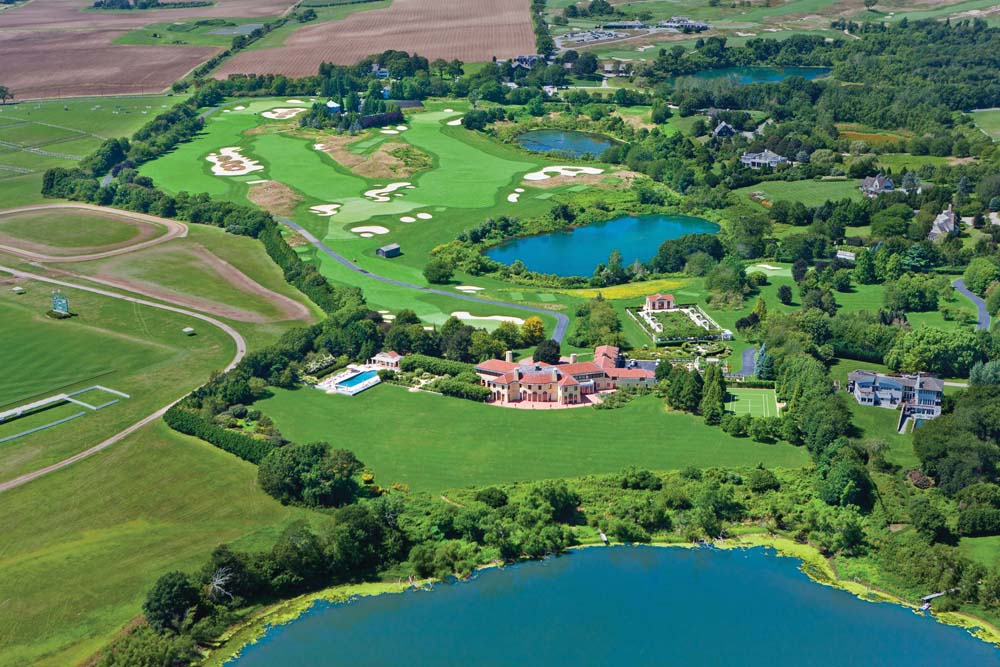
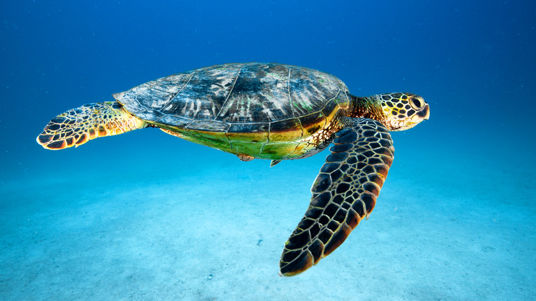
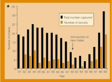
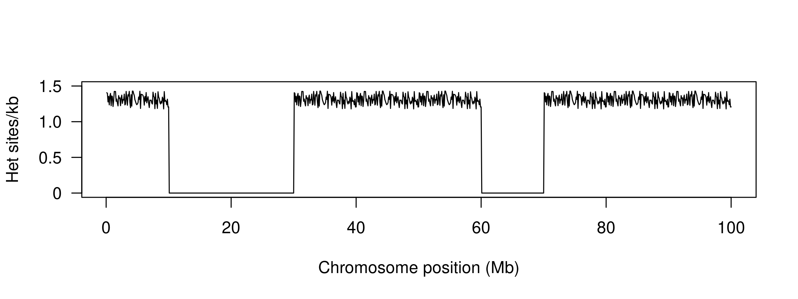
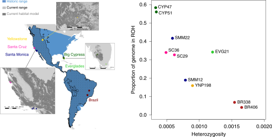
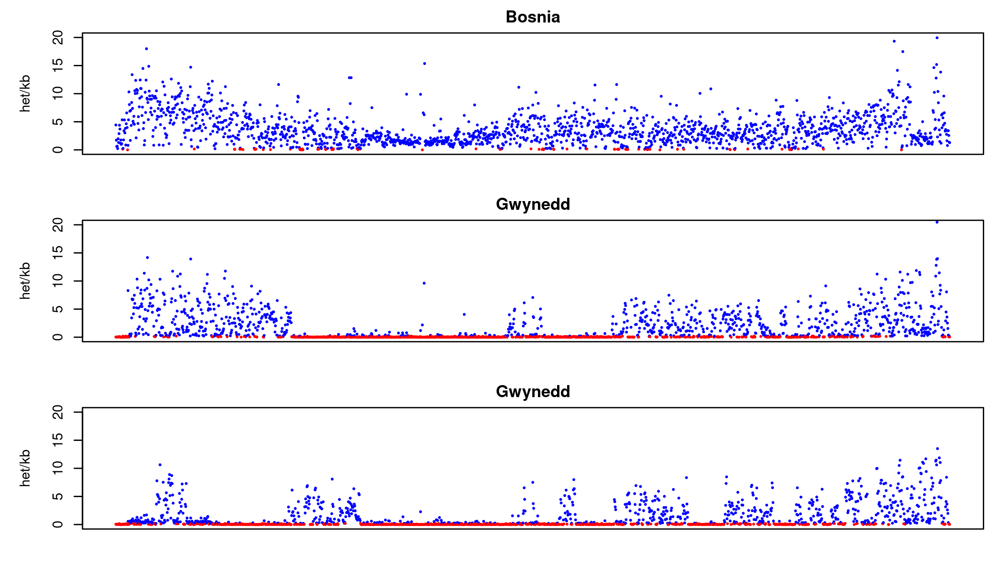

<!-- adding bold and italic options -->

## Lecture schedule

1. Drift and variation (Evolution: Chapter 6)
2. **Conservation genetics (Evolution: Chapter 6)**
3. Phylogeny 1 (Evolution: Chapter 16)
4. Phylogeny 2 (Evolution: Chapter 16)

---

## Genetic drift summary

- Allele frequencies will change from one generation to the next due to chance events
- Such as survival, reproduction, and inheritance.
- Drift is unbiased, no allele is favoured
- **Drift causes a loss of genetic variation** (replaced by mutation or gene flow)
- **Strength of drift is larger in small populations**
- Drift causes populations to become different
- Selection share some features with drift, but alleles are favoured
- Selection is more effective when drift is weak
- We need to account for drift when testing for selection

--- .segue .dark 

## Effective population size

---

## Effective population size (Ne)

**The effective population size (Ne) is the size of an idealised hermaphroditic population that would show the observed amount of drift**

- Loosely, the effective number of breeding individuals

**This is typically different to the census population size**

- Age of reproduction
- Mating systems
- Population structure
- Sex ratio
- Non-random mating

---

## Age of reproduction

---

## Mating systems

---

## Population structure

---

## Sex ratio

---

## Non-random mating

---

## Loss of genetic variation associated with low Ne

<iframe src = 'https://heavywatal.github.io/driftr.js/'></iframe>

--- .segue .dark 

## Why is low genetic variation bad?

--- &twocol

## Smygehuk adders

*** =left

- Population in Sweden
- Low Ne
- Isolated > 100 years
- low genetic diversity
- Population decline
- Many offspring deformed/stillborn

*** =right

--- &twocol

## Genetic rescue

*** =left

*** =right

- 20 males from other (large) populations released
- Left for 4 years
- Remaining 8 males returned to source population
- Dramatic increase in recruitment
- Increase in genetic diversity
- Reduction in stillborn offspring

---

## Adders background reading

<embed src="./assets/img/Madsen_adders.pdf" width="100%" height="500" type="application/pdf" />

--- 

## What is going on?

<iframe src = 'https://heavywatal.github.io/driftr.js/'></iframe>

---

## Why is low genetic variation bad?

- At **small population sizes** drift overwhelms the rate of mutation
- In **isolated** populations variation cannot be replaced by gene flow
- Net loss of genetic diversity

### Inbreeding depression

- Deleterious alleles more likely to increase in frequency (selection less effective)
- Deleterious alleles tend to be recessive
- Individuals increasingly homozygous as allele frequency increases (**Hardy-Weinberg**)

### Reduced evolutionary potential

- No variation = no evolution
- Unpredictable because we don't know the future precisely (disease, climate change, etc)

--- 

## Inbreeding depression

<iframe src = 'https://heavywatal.github.io/driftr.js/'></iframe>

--- 

## Reduced evolutionary potential

<iframe src = 'https://heavywatal.github.io/driftr.js/'></iframe>

--- &twocol

## Genetic rescue

*** =left

*** =right

- 20 males from other (large) populations released
- Left for 4 years
- Remaining 8 males returned to source population
- Dramatic increase in recruitment
- Increase in genetic diversity
- Reduction in stillborn offspring

--- .segue .dark 

## Conservation genetics

---

## Conservation genetics

- Applied population genetics to help conserve species

### How can it help?

- **Measure genetic variation**
- **Measure inbreeding**
- Guide breeding programmes
- Identify ancestry
- Wildlife crime

--- &twocol

## Methods: genetic variation

*** =left

**Heterozygosity**

- Measured from a single individual
- How many diploid loci have different alleles
- For example, het sites per kb

**Nuceotide diversity (π)**

- Population average heterozygosity
- Proportion of het positions between 2 randomly selected chromosomes

*** =right

---

## Methods: inbreeding

- Chromosome regions are identical by descent
- Can be calculated from pedigrees
- Genome sequencing allows identification of **runs of homozygosity (ROH)**

---

## Methods: runs of homozygosity (ROH)

- Total inbreeding = ROH content
- Recent = long ROH
- Older = short ROH

--- .segue .dark 

## Case studies

--- &twocol

## White rhinos (*Ceratotherium simum*)

*** =left

- Two subspecies: northern and southern
- ~20,000 southern white rhinos (in 2015)
- Northern white rhino functionally extinct (2 females left in 2018)

*** =right

---

## White rhinos (*Ceratotherium simum*)

---

## White rhinos background reading

<embed src="./assets/img/Sánchez-Barreiro et al. - 2021 - Historical population declines prompted significant genomic erosion in the northern and southern white.pdf" width="100%" height="500" type="application/pdf" />

--- &twocol

## Pumas (*Puma concolor*)

*** =left

- Puma/cougar/mountain lion/panther
- Widespread across North and South America
- IUCN listed as least concern
- But some populations are small and isolated
- E.g. Florida panther listed as critically endangered
- 8 females introduced from Texas to reduce inbreeding

*** =right

---

## Pumas (*Puma concolor*)

---

## Pumas (*Puma concolor*)

---

## Pumas background reading

<embed src="./assets/img/Saremi et al. - 2019 - Puma genomes from North and South America provide insights into the genomic consequences of inbreeding.pdf" width="100%" height="500" type="application/pdf" />

--- &twocol

## Isle Royale wolves

*** =left

- Colonised 2-3 wolves in 1940s
- Expanded to 50 individuals
- Crashed to 14 individuals in 1980s
- Notable improvement 1997 with migration of a single male, followed by second crash
- Moose increased in this period
- 2 wolves left in 2018: father-daughter and half sibs

*** =right

---

## Isle Royale wolves

--- 

## Wolf reading

<embed src="./assets/img/sciadv.aau0757.pdf" width="100%" height="500" type="application/pdf" />

--- &twocol

## Adders, UK

*** =left

- UK redlist 
- Threatened England
- Near threatened Wales, Scotland
- Large scale declines
- Many pops < 10 adults

*** =right

--- bg:white

## Adders, chromosome 6.

--- &thankyou

## Next time:

**Phylogeny 1**
